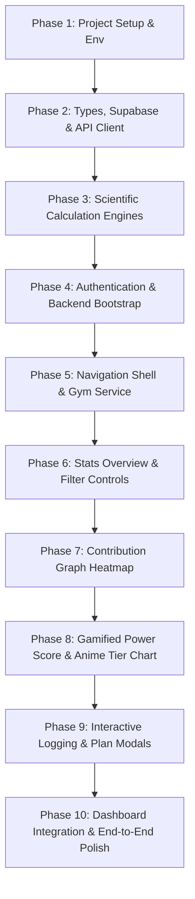

# Gym-Git Mobile Application — Phase-by-Phase Implementation Guide

> **For Autonomous Coding Agents & Developers**  
> This guide breaks down the implementation of the **Gym-Git Mobile App** into **10 Sequential Implementation Phases**. Each phase defines clear goals, required files, precise code specifications, and verification checkpoints so a coding agent can build the entire application incrementally from scratch to completion.

---

## Architecture Overview & System Design

```
 ┌──────────────────────────────────────────────────────────┐
 │                   React Native Expo                      │
 │  (Expo Router + AuthContext + AsyncStorage Session)      │
 └───────────┬──────────────────────────────────┬───────────┘
             │                                  │
             │ 1. Supabase OAuth / Email Auth   │ 2. API Requests
             ▼                                  ▼
   ┌──────────────────┐                ┌──────────────────┐
   │  Supabase Auth   │                │   Go/Gin Backend │
   │ (JWT Generation) │                │   (/api/v1/*)    │
   └─────────┬────────┘                └─────────┬────────┘
             │                                    │
             └───────── Bearer <JWT Token> ───────┘
```

---

## Implementation Roadmap (10 Phases)



---

## Phase 1: Project Setup, Dependencies & Environment

### Goal
Initialize the React Native Expo app with TypeScript and Expo Router, install all required native dependencies, set up directory structure, and configure environment variables.

### Target Files to Create / Configure
- `package.json`
- `app.json`
- `.env`
- Directory structure: `app/`, `components/`, `lib/`, `utils/`, `assets/`

### Step 1.1: Initialize Expo Router App
```bash
npx create-expo-app@latest gymgit-mobile --template default
cd gymgit-mobile
```

### Step 1.2: Install Required Dependencies
```bash
# Authentication & Local Storage
npx expo install @supabase/supabase-js @react-native-async-storage/async-storage

# Navigation, Web Browser & OAuth
npx expo install expo-router expo-web-browser expo-auth-session expo-crypto

# UI Controls, Animations, Icons & Haptics
npx expo install lucide-react-native react-native-svg expo-linear-gradient expo-haptics expo-status-bar react-native-reanimated react-native-gesture-handler react-native-safe-area-context
```

### Step 1.3: Environment Variables (`.env`)
Create `.env` in project root:
```env
EXPO_PUBLIC_SUPABASE_URL=https://your-supabase-project.supabase.co
EXPO_PUBLIC_SUPABASE_ANON_KEY=your-supabase-anon-key
# Note: Android Emulator use http://10.0.2.2:8080/api/v1. Physical Device use LAN IP (e.g. http://192.168.1.50:8080/api/v1)
EXPO_PUBLIC_API_URL=http://10.0.2.2:8080/api/v1
```

### Verification Checkpoint
Run `npx expo start` and verify that the Expo development server starts without syntax or dependency errors.

---

## Phase 2: Core Domain Types, Supabase & API Client Layer

### Goal
Define all TypeScript domain interfaces, configure the mobile Supabase client with `AsyncStorage`, and implement the centralized API fetch wrapper with automatic JWT injection.

### Target Files to Create
1. `lib/types.ts`
2. `assets/anime.ts`
3. `utils/supabase.ts`
4. `utils/api.ts`

### Code Specifications

#### 1. `lib/types.ts`
```typescript
export type WorkoutType = string;

export interface WeeklyPlan {
  id: string;
  name: string;
  description?: string;
  categories: string[];
}

export interface GymLog {
  id: string;
  date: string; // YYYY-MM-DD
  hours: number;
  workoutType: WorkoutType;
  notes?: string;
  updatedAt?: string;
}

export interface User {
  email: string;
  name: string;
  avatarUrl?: string;
  provider: 'email' | 'google';
  weeklyPlan?: WeeklyPlan;
}

export interface MonthlyStat {
  month: string;
  monthIndex: number;
  year: number;
  count: number;
  totalHours: number;
}

export interface Stats {
  currentStreak: number;
  longestStreak: number;
  totalDays: number;
  totalHours: number;
  averageHoursPerSession: number;
  monthlyData: MonthlyStat[];
  scientificStreak?: StreakAnalysis;
}

export type TimeframeView = 'year' | 'month' | 'week';

export interface AnimePower {
  id: string;
  name: string;
  image: any;
  power: number;
}

export interface PowerScoreBreakdown {
  consistencyScore: number;    // 0 - 45
  durationQualityScore: number;// 0 - 25
  varietyScore: number;        // 0 - 20
  momentumScore: number;       // 0 - 10
  totalScore: number;          // 0 - 100
  character: AnimePower;
  activeDays: number;
  totalDays: number;
  avgSessionHours: number;
  uniqueTypesCount: number;
  evaluationText: string;
}

export interface StreakAnalysis {
  currentStreakDays: number;
  longestStreakDays: number;
  complianceRate: number;
  currentWeekDone: number;
  currentWeekTarget: number;
  currentWeekStatus: 'On Track' | 'Target Met' | 'Behind';
  breakReason?: string;
}

export const PREBUILT_PLANS: WeeklyPlan[] = [
  {
    id: 'ppl-standard',
    name: 'Push / Pull / Legs (PPL)',
    description: 'Classic 4-day active split focusing on movement patterns.',
    categories: ['Push', 'Pull', 'Legs', 'Cardio', 'Custom'],
  },
  {
    id: 'ppl-core',
    name: 'PPL + Core & Cardio',
    description: 'Comprehensive 5-day athletic split.',
    categories: ['Push', 'Pull', 'Legs', 'Core', 'Cardio', 'Custom'],
  },
  {
    id: 'upper-lower',
    name: 'Upper / Lower Split',
    description: '4-day hypertrophy split split into upper & lower body.',
    categories: ['Upper Body', 'Lower Body', 'Core & Cardio', 'Custom'],
  },
  {
    id: 'full-body',
    name: 'Full Body & Functional',
    description: '3-day full body strength & conditioning plan.',
    categories: ['Full Body', 'Cardio', 'Mobility', 'Custom'],
  },
];
```

#### 2. `assets/anime.ts`
```typescript
import { AnimePower } from '@/lib/types';

export const animePowerLevels: AnimePower[] = [
  { id: 'aqua', name: 'Aqua', image: require('./anime/aqua.png'), power: 5 },
  { id: 'muminrider', name: 'Mumen Rider', image: require('./anime/muminrider.png'), power: 25 },
  { id: 'tanjiro', name: 'Tanjiro', image: require('./anime/tanjiro.png'), power: 55 },
  { id: 'deku', name: 'Deku', image: require('./anime/deku.png'), power: 72 },
  { id: 'gojo', name: 'Gojo', image: require('./anime/gojo.png'), power: 88 },
  { id: 'naruto', name: 'Naruto', image: require('./anime/naruto.png'), power: 94 },
  { id: 'luffy', name: 'Luffy', image: require('./anime/luffy.png'), power: 97 },
  { id: 'goku', name: 'Goku', image: require('./anime/goku.png'), power: 100 },
];
```

#### 3. `utils/supabase.ts`
```typescript
import AsyncStorage from '@react-native-async-storage/async-storage';
import { createClient } from '@supabase/supabase-js';

const supabaseUrl = process.env.EXPO_PUBLIC_SUPABASE_URL || '';
const supabaseAnonKey = process.env.EXPO_PUBLIC_SUPABASE_ANON_KEY || '';

export const supabase = createClient(supabaseUrl, supabaseAnonKey, {
  auth: {
    storage: AsyncStorage,
    autoRefreshToken: true,
    persistSession: true,
    detectSessionInUrl: false,
  },
});
```

#### 4. `utils/api.ts`
```typescript
import { supabase } from './supabase';

export class ApiError extends Error {
  code: string;
  status: number;
  details?: Array<{ field: string; issue: string }>;

  constructor(message: string, code = 'API_ERROR', status = 500, details?: any) {
    super(message);
    this.name = 'ApiError';
    this.code = code;
    this.status = status;
    this.details = details;
  }
}

const getBaseUrl = (): string => {
  return (process.env.EXPO_PUBLIC_API_URL || 'http://10.0.2.2:8080/api/v1').replace(/\/$/, '');
};

async function getAccessToken(): Promise<string | null> {
  try {
    const { data: { session } } = await supabase.auth.getSession();
    if (session?.access_token) return session.access_token;
    const { data: { session: refreshed } } = await supabase.auth.refreshSession();
    return refreshed?.access_token || null;
  } catch {
    return null;
  }
}

export async function apiFetch<T = any>(endpoint: string, options: any = {}): Promise<T> {
  const baseUrl = getBaseUrl();
  const cleanEndpoint = endpoint.startsWith('/') ? endpoint : `/${endpoint}`;
  const url = `${baseUrl}${cleanEndpoint}`;

  const token = options.token || (await getAccessToken());
  const headers: Record<string, string> = {
    'Content-Type': 'application/json',
    ...(options.headers || {}),
  };

  if (token) {
    headers['Authorization'] = `Bearer ${token}`;
  }

  const response = await fetch(url, { ...options, headers });

  if (response.status === 401) {
    let errorPayload: any = null;
    try { errorPayload = await response.json(); } catch {}
    throw new ApiError(errorPayload?.error?.message || 'Unauthorized session.', 'UNAUTHORIZED', 401);
  }

  let json: any;
  try {
    json = await response.json();
  } catch {
    if (!response.ok) throw new ApiError(`HTTP Error ${response.status}`, 'HTTP_ERROR', response.status);
    return {} as T;
  }

  if (!response.ok || json?.success === false) {
    const errorData = json?.error;
    throw new ApiError(
      errorData?.message || json?.message || `API request failed: ${response.status}`,
      errorData?.code || `HTTP_${response.status}`,
      response.status,
      errorData?.details
    );
  }

  return (json && typeof json === 'object' && 'data' in json ? json.data : json) as T;
}

export const api = {
  get: <T = any>(endpoint: string, options?: any) => apiFetch<T>(endpoint, { ...options, method: 'GET' }),
  post: <T = any>(endpoint: string, body?: any, options?: any) => apiFetch<T>(endpoint, { ...options, method: 'POST', body: body ? JSON.stringify(body) : undefined }),
  put: <T = any>(endpoint: string, body?: any, options?: any) => apiFetch<T>(endpoint, { ...options, method: 'PUT', body: body ? JSON.stringify(body) : undefined }),
  delete: <T = any>(endpoint: string, options?: any) => apiFetch<T>(endpoint, { ...options, method: 'DELETE' }),
};
```

### Verification Checkpoint
Import `api` and `supabase` in a test script or app component and verify that type declarations compile cleanly.

---

## Phase 3: Client-Side Scientific Calculation Engines

### Goal
Implement pure TypeScript engines for calculating Scientific Power Scores (0–100 mapped to Anime Tiers) and Plan-Conforming Streaks (where scheduled rest days within rolling 7-day windows do NOT break streaks).

### Target Files to Create
1. `lib/scientific-power.ts`
2. `lib/scientific-streak.ts`

### Code Specifications

#### 1. `lib/scientific-power.ts`
```typescript
import { animePowerLevels } from '@/assets/anime';
import { GymLog, PowerScoreBreakdown } from './types';

export function calculateScientificPowerScore(
  logs: GymLog[],
  periodTotalDays: number,
  targetWeeklyDays = 4
): PowerScoreBreakdown {
  const activeLogMap = new Map<string, GymLog>();
  const workoutTypesSet = new Set<string>();
  let totalHours = 0;

  logs.forEach((log) => {
    if (log.hours > 0) {
      activeLogMap.set(log.date, log);
      workoutTypesSet.add(log.workoutType);
      totalHours += log.hours;
    }
  });

  const activeDays = activeLogMap.size;
  const totalDays = Math.max(periodTotalDays, 1);

  // 1. Consistency Score (0 - 45)
  const targetActiveDays = Math.max(1, Math.round((targetWeeklyDays / 7) * totalDays));
  const consistencyRatio = Math.min(1.0, activeDays / targetActiveDays);
  const consistencyScore = Math.round(consistencyRatio * 45);

  // 2. Duration Quality Score (0 - 25) - Sweet spot: 0.75h to 1.75h
  let totalQualityScore = 0;
  if (activeDays > 0) {
    activeLogMap.forEach((log) => {
      const h = log.hours;
      let sessionQuality = 0;
      if (h >= 0.75 && h <= 1.75) {
        sessionQuality = 1.0;
      } else if (h > 1.75) {
        sessionQuality = Math.max(0.4, 1.0 - (h - 1.75) * 0.25);
      } else {
        sessionQuality = Math.max(0.2, h / 0.75);
      }
      totalQualityScore += sessionQuality;
    });
  }
  const avgSessionQuality = activeDays > 0 ? totalQualityScore / activeDays : 0;
  const durationQualityScore = Math.round(avgSessionQuality * 25);

  // 3. Variety Score (0 - 20)
  const uniqueTypesCount = workoutTypesSet.size;
  const varietyRatio = Math.min(1.0, uniqueTypesCount / 3);
  const varietyScore = Math.round(varietyRatio * 20);

  // 4. Momentum Score (0 - 10)
  const momentumRatio = activeDays > 0 ? Math.min(1.0, activeDays / (totalDays * 0.5)) : 0;
  const momentumScore = Math.round(momentumRatio * 10);

  // Total Power Score (0 - 100)
  const rawTotal = consistencyScore + durationQualityScore + varietyScore + momentumScore;
  const totalScore = activeDays > 0 ? Math.min(100, Math.max(5, rawTotal)) : 0;

  // Match Anime Tier
  const sortedChars = [...animePowerLevels].sort((a, b) => b.power - a.power);
  const matched = sortedChars.find((c) => totalScore >= c.power) || animePowerLevels[0];

  const avgSessionHours = activeDays > 0 ? Number((totalHours / activeDays).toFixed(1)) : 0;
  let evaluationText = 'No gym attendance recorded yet.';
  if (activeDays > 0) {
    if (consistencyScore >= 40 && durationQualityScore >= 20) {
      evaluationText = 'Ultra Instinct consistency! Perfect session duration and frequency.';
    } else if (consistencyScore >= 30) {
      evaluationText = 'High discipline! Consistent workout schedule with solid muscle balance.';
    } else if (durationQualityScore < 15 && totalHours > 10) {
      evaluationText = 'Warning: Overlong single sessions! Consistency matters more than binge workouts.';
    } else {
      evaluationText = 'Building fitness habits. Increase weekly frequency for higher power tiers!';
    }
  }

  return {
    consistencyScore,
    durationQualityScore,
    varietyScore,
    momentumScore,
    totalScore,
    character: matched,
    activeDays,
    totalDays,
    avgSessionHours,
    uniqueTypesCount,
    evaluationText,
  };
}
```

#### 2. `lib/scientific-streak.ts`
```typescript
import { GymLog, StreakAnalysis, WeeklyPlan } from './types';

export function formatDateKey(date: Date): string {
  const yyyy = date.getFullYear();
  const mm = String(date.getMonth() + 1).padStart(2, '0');
  const dd = String(date.getDate()).padStart(2, '0');
  return `${yyyy}-${mm}-${dd}`;
}

export function calculateScientificStreak(logs: GymLog[], plan?: WeeklyPlan): StreakAnalysis {
  let targetDaysPerWeek = 4;
  if (plan?.categories) {
    const activeCats = plan.categories.filter((c) => c.toLowerCase() !== 'rest');
    targetDaysPerWeek = Math.min(6, Math.max(3, activeCats.length));
  }

  const activeDatesSet = new Set<string>();
  logs.forEach((log) => {
    if (log.hours > 0) activeDatesSet.add(log.date);
  });

  const today = new Date();

  const getWindowActiveCount = (endDate: Date): number => {
    let count = 0;
    for (let i = 0; i < 7; i++) {
      const d = new Date(endDate);
      d.setDate(endDate.getDate() - i);
      if (activeDatesSet.has(formatDateKey(d))) count++;
    }
    return count;
  };

  const isDateCompliant = (checkDate: Date): boolean => {
    const dStr = formatDateKey(checkDate);
    if (activeDatesSet.has(dStr)) return true;
    return getWindowActiveCount(checkDate) >= Math.max(2, targetDaysPerWeek - 1);
  };

  let currentStreakDays = 0;
  let checkDate = new Date(today);
  const yesterday = new Date(today);
  yesterday.setDate(today.getDate() - 1);

  if (!isDateCompliant(today) && isDateCompliant(yesterday)) {
    checkDate = yesterday;
  }

  while (isDateCompliant(checkDate)) {
    currentStreakDays++;
    checkDate.setDate(checkDate.getDate() - 1);
    if (currentStreakDays > 365) break;
  }

  let longestStreakDays = 0;
  let tempStreak = 0;
  const startDate = new Date(today);
  startDate.setDate(today.getDate() - 365);

  let iterDate = new Date(startDate);
  while (iterDate <= today) {
    if (isDateCompliant(iterDate)) {
      tempStreak++;
      if (tempStreak > longestStreakDays) longestStreakDays = tempStreak;
    } else {
      tempStreak = 0;
    }
    iterDate.setDate(iterDate.getDate() + 1);
  }

  const dayOfWeek = today.getDay();
  const distanceToMon = dayOfWeek === 0 ? -6 : 1 - dayOfWeek;
  const currentMonday = new Date(today);
  currentMonday.setDate(today.getDate() + distanceToMon);

  let currentWeekDone = 0;
  for (let i = 0; i < 7; i++) {
    const d = new Date(currentMonday);
    d.setDate(currentMonday.getDate() + i);
    if (d > today) break;
    if (activeDatesSet.has(formatDateKey(d))) currentWeekDone++;
  }

  let currentWeekStatus: 'On Track' | 'Target Met' | 'Behind' = 'On Track';
  if (currentWeekDone >= targetDaysPerWeek) {
    currentWeekStatus = 'Target Met';
  } else if (dayOfWeek >= 5 && currentWeekDone < targetDaysPerWeek - 1) {
    currentWeekStatus = 'Behind';
  }

  let totalTrackedDays = 0;
  let totalCompliantDays = 0;
  let evalDate = new Date(startDate);
  while (evalDate <= today) {
    totalTrackedDays++;
    if (isDateCompliant(evalDate)) totalCompliantDays++;
    evalDate.setDate(evalDate.getDate() + 1);
  }

  const complianceRate = Math.round((totalCompliantDays / Math.max(1, totalTrackedDays)) * 100);

  return {
    currentStreakDays,
    longestStreakDays: Math.max(longestStreakDays, currentStreakDays),
    complianceRate,
    currentWeekDone,
    currentWeekTarget: targetDaysPerWeek,
    currentWeekStatus,
  };
}
```

### Verification Checkpoint
Pass sample log arrays to `calculateScientificPowerScore` and `calculateScientificStreak` to verify expected scores and character tier outputs.

---

## Phase 4: Authentication System, Backend Bootstrap & Login UI

### Goal
Implement the mobile Auth Context, bridging Supabase Auth with the custom Go backend (`POST /api/v1/auth/bootstrap` and `GET /api/v1/auth/me`), and build the glassmorphic Login/Signup screen.

### Target Files to Create
1. `lib/auth-context.tsx`
2. `components/AuthGuard.tsx`
3. `app/login.tsx`

### Code Specifications

#### 1. `lib/auth-context.tsx`
Handles Supabase Auth events and executes the critical Go backend bootstrap request (`POST /api/v1/auth/bootstrap`).

```typescript
import React, { createContext, useContext, useEffect, useState } from 'react';
import { supabase } from '@/utils/supabase';
import { api } from '@/utils/api';
import { User, WeeklyPlan } from './types';
import * as WebBrowser from 'expo-web-browser';
import * as AuthSession from 'expo-auth-session';

WebBrowser.maybeCompleteAuthSession();

interface AuthContextType {
  user: User | null;
  loading: boolean;
  login: (email: string, pass: string) => Promise<void>;
  signup: (email: string, pass: string, name?: string) => Promise<void>;
  loginWithGoogle: () => Promise<void>;
  logout: () => Promise<void>;
  updateUserPlan: (plan: WeeklyPlan) => Promise<void>;
  bootstrapBackend: (selectedPlan?: WeeklyPlan, accessToken?: string) => Promise<User | null>;
}

const AuthContext = createContext<AuthContextType | undefined>(undefined);

export function AuthProvider({ children }: { children: React.ReactNode }) {
  const [user, setUser] = useState<User | null>(null);
  const [loading, setLoading] = useState<boolean>(true);

  const bootstrapBackend = async (selectedPlan?: WeeklyPlan, accessToken?: string) => {
    let token = accessToken;
    if (!token) {
      const { data: { session } } = await supabase.auth.getSession();
      token = session?.access_token;
    }
    if (!token) {
      setUser(null);
      return null;
    }

    try {
      // 1. Critical Bootstrap Step (Idempotent profile creation in Postgres)
      await api.post('/auth/bootstrap', { selectedPlanId: selectedPlan?.id || 'ppl-standard' }, { token });

      // 2. Fetch User Profile & Active Plan
      const raw = await api.get<any>('/auth/me', { token });
      const u = raw.user || raw;
      const p = raw.plan || u.weeklyPlan;

      const mappedUser: User = {
        email: u.email || '',
        name: u.name || (u.email ? u.email.split('@')[0] : 'Gymbro'),
        avatarUrl: u.avatar_url || u.avatarUrl,
        provider: u.provider || 'email',
        weeklyPlan: p ? { id: p.id, name: p.name, description: p.description, categories: p.categories || [] } : undefined,
      };

      setUser(mappedUser);
      return mappedUser;
    } catch (err) {
      console.error('[Bootstrap Failed]', err);
      setUser(null);
      return null;
    }
  };

  useEffect(() => {
    async function initSession() {
      try {
        const { data: { session } } = await supabase.auth.getSession();
        if (session?.access_token) {
          await bootstrapBackend(undefined, session.access_token);
        }
      } catch (err) {
        console.error(err);
      } finally {
        setLoading(false);
      }
    }

    initSession();

    const { data: { subscription } } = supabase.auth.onAuthStateChange(async (event, session) => {
      if (event === 'SIGNED_IN' && session?.access_token) {
        await bootstrapBackend(undefined, session.access_token);
      } else if (event === 'SIGNED_OUT') {
        setUser(null);
      }
    });

    return () => subscription.unsubscribe();
  }, []);

  const login = async (email: string, pass: string) => {
    setLoading(true);
    try {
      const { data, error } = await supabase.auth.signInWithPassword({ email, password: pass });
      if (error) throw new Error(error.message);
      if (data.session?.access_token) {
        await bootstrapBackend(undefined, data.session.access_token);
      }
    } finally {
      setLoading(false);
    }
  };

  const signup = async (email: string, pass: string, name?: string) => {
    setLoading(true);
    try {
      const { data, error } = await supabase.auth.signUp({
        email,
        password: pass,
        options: { data: { name: name || email.split('@')[0] } },
      });
      if (error) throw new Error(error.message);
      if (data.session?.access_token) {
        await bootstrapBackend(undefined, data.session.access_token);
      }
    } finally {
      setLoading(false);
    }
  };

  const loginWithGoogle = async () => {
    setLoading(true);
    try {
      const redirectUrl = AuthSession.makeRedirectUri({ scheme: 'gymgit' });
      const { data, error } = await supabase.auth.signInWithOAuth({
        provider: 'google',
        options: { redirectTo: redirectUrl },
      });
      if (error) throw new Error(error.message);
      if (data?.url) {
        await WebBrowser.openAuthSessionAsync(data.url, redirectUrl);
      }
    } finally {
      setLoading(false);
    }
  };

  const logout = async () => {
    setLoading(true);
    try {
      await supabase.auth.signOut();
      try { await api.post('/auth/logout'); } catch {}
      setUser(null);
    } finally {
      setLoading(false);
    }
  };

  const updateUserPlan = async (plan: WeeklyPlan) => {
    const payload: any = { plan_id: plan.id };
    if (plan.id === 'custom-plan') {
      payload.name = plan.name;
      payload.description = plan.description;
      payload.categories = plan.categories;
    }
    await api.put('/auth/plan', payload);
    if (user) setUser({ ...user, weeklyPlan: plan });
  };

  return (
    <AuthContext.Provider
      value={{
        user,
        loading,
        login,
        signup,
        loginWithGoogle,
        logout,
        updateUserPlan,
        bootstrapBackend,
      }}
    >
      {children}
    </AuthContext.Provider>
  );
}

export function useAuth() {
  const ctx = useContext(AuthContext);
  if (!ctx) throw new Error('useAuth must be used within AuthProvider');
  return ctx;
}
```

#### 2. `components/AuthGuard.tsx`
```typescript
import React, { useEffect } from 'react';
import { View, Text, ActivityIndicator } from 'react-native';
import { useAuth } from '@/lib/auth-context';
import { useRouter } from 'expo-router';

export default function AuthGuard({ children }: { children: React.ReactNode }) {
  const { user, loading } = useAuth();
  const router = useRouter();

  useEffect(() => {
    if (!loading && !user) {
      router.replace('/login');
    }
  }, [user, loading, router]);

  if (loading) {
    return (
      <View style={{ flex: 1, backgroundColor: '#09090b', justifyContent: 'center', alignItems: 'center' }}>
        <ActivityIndicator size="large" color="#10b981" />
        <Text style={{ color: '#a1a1aa', marginTop: 12, fontSize: 14 }}>Loading Gym-Git workspace...</Text>
      </View>
    );
  }

  if (!user) return null;
  return <>{children}</>;
}
```

#### 3. `app/login.tsx`
Glassmorphic mobile sign-in/sign-up screen with dark zinc styling (`#09090b`) and emerald accents (`#10b981`).

```typescript
import React, { useState } from 'react';
import { View, Text, TextInput, TouchableOpacity, ActivityIndicator, Alert, ScrollView } from 'react-native';
import { useAuth } from '@/lib/auth-context';
import { useRouter } from 'expo-router';
import { Dumbbell, Mail, Lock, User as UserIcon } from 'lucide-react-native';

export default function LoginScreen() {
  const { login, signup, loginWithGoogle } = useAuth();
  const router = useRouter();

  const [mode, setMode] = useState<'signin' | 'signup'>('signin');
  const [name, setName] = useState('');
  const [email, setEmail] = useState('');
  const [password, setPassword] = useState('');
  const [submitting, setSubmitting] = useState(false);
  const [errorMsg, setErrorMsg] = useState('');

  const handleSubmit = async () => {
    if (!email || !password) {
      setErrorMsg('Please enter email and password.');
      return;
    }
    if (mode === 'signup' && !name) {
      setErrorMsg('Please enter your name.');
      return;
    }

    setErrorMsg('');
    setSubmitting(true);
    try {
      if (mode === 'signup') {
        await signup(email, password, name);
      } else {
        await login(email, password);
      }
      router.replace('/');
    } catch (err: any) {
      setErrorMsg(err?.message || 'Authentication failed.');
    } finally {
      setSubmitting(false);
    }
  };

  return (
    <ScrollView contentContainerStyle={{ flexGrow: 1, backgroundColor: '#09090b', justifyContent: 'center', padding: 20 }}>
      <View style={{ backgroundColor: '#18181b', borderRadius: 24, padding: 24, borderWidth: 1, borderColor: '#27272a' }}>
        {/* Header */}
        <View style={{ alignItems: 'center', marginBottom: 20 }}>
          <View style={{ width: 48, height: 48, borderRadius: 16, backgroundColor: '#10b981', justifyContent: 'center', alignItems: 'center', marginBottom: 12 }}>
            <Dumbbell size={28} color="#09090b" />
          </View>
          <Text style={{ fontSize: 28, fontWeight: '900', color: '#10b981' }}>Gym-Git</Text>
          <Text style={{ fontSize: 13, color: '#a1a1aa', marginTop: 4 }}>Commit your workouts like code</Text>
        </View>

        {/* Mode Switcher */}
        <View style={{ flexDirection: 'row', backgroundColor: '#09090b', padding: 4, borderRadius: 12, marginBottom: 20 }}>
          <TouchableOpacity
            onPress={() => { setMode('signin'); setErrorMsg(''); }}
            style={{ flex: 1, paddingVertical: 10, borderRadius: 8, backgroundColor: mode === 'signin' ? '#10b981' : 'transparent', alignItems: 'center' }}
          >
            <Text style={{ fontWeight: '700', fontSize: 13, color: mode === 'signin' ? '#09090b' : '#a1a1aa' }}>Sign In</Text>
          </TouchableOpacity>
          <TouchableOpacity
            onPress={() => { setMode('signup'); setErrorMsg(''); }}
            style={{ flex: 1, paddingVertical: 10, borderRadius: 8, backgroundColor: mode === 'signup' ? '#10b981' : 'transparent', alignItems: 'center' }}
          >
            <Text style={{ fontWeight: '700', fontSize: 13, color: mode === 'signup' ? '#09090b' : '#a1a1aa' }}>Create Account</Text>
          </TouchableOpacity>
        </View>

        {errorMsg !== '' && (
          <View style={{ backgroundColor: 'rgba(239,68,68,0.1)', padding: 12, borderRadius: 12, marginBottom: 16, borderWidth: 1, borderColor: 'rgba(239,68,68,0.3)' }}>
            <Text style={{ color: '#f87171', fontSize: 12 }}>{errorMsg}</Text>
          </View>
        )}

        {/* Google OAuth Button */}
        <TouchableOpacity
          onPress={loginWithGoogle}
          style={{ backgroundColor: '#27272a', paddingVertical: 12, borderRadius: 12, alignItems: 'center', marginBottom: 20 }}
        >
          <Text style={{ color: '#f4f4f5', fontWeight: '700', fontSize: 14 }}>Continue with Google</Text>
        </TouchableOpacity>

        {/* Inputs */}
        {mode === 'signup' && (
          <View style={{ marginBottom: 14 }}>
            <Text style={{ color: '#d4d4d8', fontSize: 12, fontWeight: '600', marginBottom: 6 }}>Full Name</Text>
            <TextInput
              value={name}
              onChangeText={setName}
              placeholder="Alex Developer"
              placeholderTextColor="#71717a"
              style={{ backgroundColor: '#09090b', color: '#f4f4f5', borderRadius: 12, paddingHorizontal: 14, paddingVertical: 12, borderWidth: 1, borderColor: '#27272a' }}
            />
          </View>
        )}

        <View style={{ marginBottom: 14 }}>
          <Text style={{ color: '#d4d4d8', fontSize: 12, fontWeight: '600', marginBottom: 6 }}>Email Address</Text>
          <TextInput
            value={email}
            onChangeText={setEmail}
            autoCapitalize="none"
            keyboardType="email-address"
            placeholder="you@example.com"
            placeholderTextColor="#71717a"
            style={{ backgroundColor: '#09090b', color: '#f4f4f5', borderRadius: 12, paddingHorizontal: 14, paddingVertical: 12, borderWidth: 1, borderColor: '#27272a' }}
          />
        </View>

        <View style={{ marginBottom: 20 }}>
          <Text style={{ color: '#d4d4d8', fontSize: 12, fontWeight: '600', marginBottom: 6 }}>Password</Text>
          <TextInput
            value={password}
            onChangeText={setPassword}
            secureTextEntry
            placeholder="••••••••"
            placeholderTextColor="#71717a"
            style={{ backgroundColor: '#09090b', color: '#f4f4f5', borderRadius: 12, paddingHorizontal: 14, paddingVertical: 12, borderWidth: 1, borderColor: '#27272a' }}
          />
        </View>

        <TouchableOpacity
          onPress={handleSubmit}
          disabled={submitting}
          style={{ backgroundColor: '#10b981', paddingVertical: 14, borderRadius: 12, alignItems: 'center' }}
        >
          {submitting ? (
            <ActivityIndicator color="#09090b" />
          ) : (
            <Text style={{ color: '#09090b', fontWeight: '800', fontSize: 15 }}>
              {mode === 'signup' ? 'Create Account & Start' : 'Sign In'}
            </Text>
          )}
        </TouchableOpacity>
      </View>
    </ScrollView>
  );
}
```

### Verification Checkpoint
Run the app, verify login screen renders, test registration/login against Supabase & Go backend, and check user profile retrieval.

---

## Phase 5: Navigation Shell & Gym Service Layer

### Goal
Configure Expo Router layout structure (`app/_layout.tsx` and `app/(app)/_layout.tsx`), create `lib/gym-service.ts` for API CRUD operations, and build the navigation header (`components/Header.tsx`).

### Target Files to Create
1. `app/_layout.tsx`
2. `app/(app)/_layout.tsx`
3. `lib/gym-service.ts`
4. `components/Header.tsx`

### Code Specifications

#### 1. `app/_layout.tsx`
```typescript
import React from 'react';
import { Stack } from 'expo-router';
import { AuthProvider } from '@/lib/auth-context';
import { StatusBar } from 'expo-status-bar';

export default function RootLayout() {
  return (
    <AuthProvider>
      <StatusBar style="light" />
      <Stack screenOptions={{ headerShown: false, contentStyle: { backgroundColor: '#09090b' } }}>
        <Stack.Screen name="login" />
        <Stack.Screen name="(app)" />
      </Stack>
    </AuthProvider>
  );
}
```

#### 2. `app/(app)/_layout.tsx`
```typescript
import React from 'react';
import { Stack } from 'expo-router';
import AuthGuard from '@/components/AuthGuard';

export default function AppLayout() {
  return (
    <AuthGuard>
      <Stack screenOptions={{ headerShown: false }} />
    </AuthGuard>
  );
}
```

#### 3. `lib/gym-service.ts`
```typescript
import { api } from '@/utils/api';
import { calculateScientificPowerScore, PowerScoreBreakdown } from './scientific-power';
import { GymLog, MonthlyStat, Stats, WeeklyPlan } from './types';

export function mapGymLog(raw: any): GymLog {
  if (!raw) return { id: '', date: '', hours: 0, workoutType: 'Custom' };
  return {
    id: raw.id || '',
    date: raw.date || '',
    hours: typeof raw.hours === 'number' ? raw.hours : parseFloat(raw.hours || '0'),
    workoutType: raw.workout_type || raw.workoutType || 'Custom',
    notes: raw.notes || undefined,
    updatedAt: raw.updated_at || raw.updatedAt,
  };
}

export async function fetchGymLogs(startDate?: string, endDate?: string, workoutType?: string): Promise<GymLog[]> {
  const queryParams = new URLSearchParams();
  if (startDate) queryParams.append('startDate', startDate);
  if (endDate) queryParams.append('endDate', endDate);
  if (workoutType && workoutType !== 'All') queryParams.append('workoutType', workoutType);

  const queryString = queryParams.toString();
  const endpoint = `/logs${queryString ? `?${queryString}` : ''}`;
  const rawLogs = await api.get<any[]>(endpoint);
  return (Array.isArray(rawLogs) ? rawLogs : []).map(mapGymLog);
}

export async function saveGymLog(date: string, hours: number, workoutType: string, notes?: string): Promise<GymLog> {
  const payload = { date, hours, workout_type: workoutType, notes: notes || undefined };
  const rawLog = await api.post<any>('/logs', payload);
  return mapGymLog(rawLog);
}

export async function deleteGymLog(date: string): Promise<void> {
  await api.delete(`/logs/${date}`);
}

export async function fetchDashboardStats(_userPlan?: WeeklyPlan): Promise<Stats> {
  const [rawStats, logs] = await Promise.all([
    api.get<any>('/stats').catch(() => null),
    fetchGymLogs().catch(() => []),
  ]);

  let oldestDate = new Date();
  if (logs.length > 0) {
    logs.forEach((log) => {
      const logDate = new Date(log.date);
      if (logDate < oldestDate) oldestDate = logDate;
    });
  }

  const monthNames = ['Jan', 'Feb', 'Mar', 'Apr', 'May', 'Jun', 'Jul', 'Aug', 'Sep', 'Oct', 'Nov', 'Dec'];
  const today = new Date();
  const currentYear = today.getFullYear();
  const startYear = oldestDate.getFullYear();
  const startMonthIdx = oldestDate.getMonth();

  const monthlyData: MonthlyStat[] = [];
  let tempYear = startYear;
  let tempMonthIdx = startMonthIdx;

  while (tempYear < currentYear || (tempYear === currentYear && tempMonthIdx <= 11)) {
    let count = 0;
    let totalHours = 0;

    logs.forEach((log) => {
      if (!log.date) return;
      const [yStr, mStr] = log.date.split('-');
      if (parseInt(yStr, 10) === tempYear && parseInt(mStr, 10) - 1 === tempMonthIdx) {
        count += 1;
        totalHours += log.hours || 0;
      }
    });

    monthlyData.push({
      month: monthNames[tempMonthIdx],
      monthIndex: tempMonthIdx,
      year: tempYear,
      count,
      totalHours: Math.round(totalHours * 10) / 10,
    });

    tempMonthIdx++;
    if (tempMonthIdx > 11) {
      tempMonthIdx = 0;
      tempYear++;
    }
  }

  if (monthlyData.length === 0) {
    monthlyData.push({ month: monthNames[today.getMonth()], monthIndex: today.getMonth(), year: currentYear, count: 0, totalHours: 0 });
  }

  const streakObj = rawStats?.streak || {};
  const currentStreak = streakObj.current_streak ?? streakObj.currentStreak ?? 0;
  const totalDays = rawStats?.total_sessions ?? rawStats?.totalDays ?? logs.length;
  const totalHours = rawStats?.total_hours ?? rawStats?.totalHours ?? 0;
  const averageHoursPerSession = rawStats?.avg_session_duration ?? rawStats?.averageHoursPerSession ?? 0;

  return {
    currentStreak,
    longestStreak: currentStreak,
    totalDays,
    totalHours: Math.round(totalHours * 10) / 10,
    averageHoursPerSession: Math.round(averageHoursPerSession * 10) / 10,
    monthlyData,
  };
}
```

#### 4. `components/Header.tsx`
```typescript
import React from 'react';
import { View, Text, TouchableOpacity, Image } from 'react-native';
import { useAuth } from '@/lib/auth-context';
import { Dumbbell, Flame, LogOut } from 'lucide-react-native';
import * as Haptics from 'expo-haptics';

interface HeaderProps {
  currentStreak?: number;
}

export default function Header({ currentStreak = 0 }: HeaderProps) {
  const { user, logout } = useAuth();

  const handleLogout = () => {
    Haptics.impactAsync(Haptics.ImpactFeedbackStyle.Medium);
    logout();
  };

  return (
    <View style={{ flexDirection: 'row', alignItems: 'center', justifyContent: 'space-between', paddingHorizontal: 16, paddingVertical: 12, backgroundColor: '#09090b', borderBottomWidth: 1, borderBottomColor: '#18181b' }}>
      <View style={{ flexDirection: 'row', alignItems: 'center', gap: 8 }}>
        <View style={{ width: 36, height: 36, borderRadius: 10, backgroundColor: '#10b981', justifyContent: 'center', alignItems: 'center' }}>
          <Dumbbell size={20} color="#09090b" />
        </View>
        <Text style={{ fontSize: 18, fontWeight: '900', color: '#10b981' }}>Gym-Git</Text>
      </View>

      <View style={{ flexDirection: 'row', alignItems: 'center', backgroundColor: '#18181b', paddingHorizontal: 12, paddingVertical: 6, borderRadius: 20, gap: 6 }}>
        <Flame size={16} color="#f59e0b" />
        <Text style={{ color: '#f59e0b', fontWeight: '800', fontSize: 13 }}>{currentStreak} Days</Text>
      </View>

      <TouchableOpacity onPress={handleLogout} style={{ padding: 8, borderRadius: 10, backgroundColor: '#18181b' }}>
        <LogOut size={18} color="#ef4444" />
      </TouchableOpacity>
    </View>
  );
}
```

### Verification Checkpoint
Verify navigation guards work, header renders user streak badge, and logout triggers haptic feedback.

---

## Phase 6: Stats Overview & Activity Filter Bar

### Goal
Implement dashboard stat summary cards (`components/StatsOverview.tsx`) and activity filter pills (`components/FilterBar.tsx`).

### Target Files to Create
1. `components/StatsOverview.tsx`
2. `components/FilterBar.tsx`

### Code Specifications

#### 1. `components/StatsOverview.tsx`
Renders 4 summary stats cards:
- **Current Streak:** Days + Rest Day Shield indicator.
- **Longest Record:** Max compliant sequence record.
- **Plan Adherence:** Compliance % + Weekly Target progress (`N/Target`).
- **Hours Invested:** Total hours logged + Session average duration.

```typescript
import React from 'react';
import { View, Text } from 'react-native';
import { Stats } from '@/lib/types';
import { Flame, Trophy, CheckCircle2, Clock } from 'lucide-react-native';

export default function StatsOverview({ stats }: { stats: Stats | null }) {
  if (!stats) return null;
  const streak = stats.scientificStreak;

  return (
    <View style={{ gap: 12, marginBottom: 16 }}>
      <View style={{ flexDirection: 'row', gap: 12 }}>
        {/* Current Streak Card */}
        <View style={{ flex: 1, backgroundColor: '#18181b', padding: 16, borderRadius: 16, borderWidth: 1, borderColor: '#27272a' }}>
          <View style={{ flexDirection: 'row', alignItems: 'center', gap: 6, marginBottom: 8 }}>
            <Flame size={16} color="#f59e0b" />
            <Text style={{ color: '#a1a1aa', fontSize: 11, fontWeight: '700', uppercase: true }}>Current Streak</Text>
          </View>
          <Text style={{ color: '#f4f4f5', fontSize: 24, fontWeight: '900' }}>{stats.currentStreak} <Text style={{ fontSize: 13, color: '#f59e0b' }}>Days</Text></Text>
          <Text style={{ color: '#10b981', fontSize: 10, fontWeight: '600', marginTop: 4 }}>Protected by plan rest days</Text>
        </View>

        {/* Longest Record Card */}
        <View style={{ flex: 1, backgroundColor: '#18181b', padding: 16, borderRadius: 16, borderWidth: 1, borderColor: '#27272a' }}>
          <View style={{ flexDirection: 'row', alignItems: 'center', gap: 6, marginBottom: 8 }}>
            <Trophy size={16} color="#10b981" />
            <Text style={{ color: '#a1a1aa', fontSize: 11, fontWeight: '700', uppercase: true }}>Record Streak</Text>
          </View>
          <Text style={{ color: '#f4f4f5', fontSize: 24, fontWeight: '900' }}>{stats.longestStreak} <Text style={{ fontSize: 13, color: '#10b981' }}>Days</Text></Text>
          <Text style={{ color: '#71717a', fontSize: 10, marginTop: 4 }}>Best compliant run</Text>
        </View>
      </View>

      <View style={{ flexDirection: 'row', gap: 12 }}>
        {/* Compliance Card */}
        <View style={{ flex: 1, backgroundColor: '#18181b', padding: 16, borderRadius: 16, borderWidth: 1, borderColor: '#27272a' }}>
          <View style={{ flexDirection: 'row', alignItems: 'center', gap: 6, marginBottom: 8 }}>
            <CheckCircle2 size={16} color="#14b8a6" />
            <Text style={{ color: '#a1a1aa', fontSize: 11, fontWeight: '700', uppercase: true }}>Adherence</Text>
          </View>
          <Text style={{ color: '#f4f4f5', fontSize: 24, fontWeight: '900' }}>{streak?.complianceRate || 92}%</Text>
          <Text style={{ color: '#14b8a6', fontSize: 10, fontWeight: '600', marginTop: 4 }}>
            Week: {streak?.currentWeekDone || 0}/{streak?.currentWeekTarget || 4} ({streak?.currentWeekStatus || 'On Track'})
          </Text>
        </View>

        {/* Total Hours Card */}
        <View style={{ flex: 1, backgroundColor: '#18181b', padding: 16, borderRadius: 16, borderWidth: 1, borderColor: '#27272a' }}>
          <View style={{ flexDirection: 'row', alignItems: 'center', gap: 6, marginBottom: 8 }}>
            <Clock size={16} color="#38bdf8" />
            <Text style={{ color: '#a1a1aa', fontSize: 11, fontWeight: '700', uppercase: true }}>Total Hours</Text>
          </View>
          <Text style={{ color: '#f4f4f5', fontSize: 24, fontWeight: '900' }}>{stats.totalHours} <Text style={{ fontSize: 13, color: '#38bdf8' }}>hrs</Text></Text>
          <Text style={{ color: '#71717a', fontSize: 10, marginTop: 4 }}>{stats.totalDays} sessions (~{stats.averageHoursPerSession}h avg)</Text>
        </View>
      </View>
    </View>
  );
}
```

#### 2. `components/FilterBar.tsx`
```typescript
import React from 'react';
import { View, Text, TouchableOpacity, ScrollView } from 'react-native';
import { WorkoutType, WeeklyPlan } from '@/lib/types';
import { SlidersHorizontal, Settings2 } from 'lucide-react-native';

interface FilterBarProps {
  activeFilter: WorkoutType | 'All';
  onFilterChange: (filter: WorkoutType | 'All') => void;
  weeklyPlan?: WeeklyPlan;
  onOpenPlanModal?: () => void;
  availableTypes?: string[];
}

export default function FilterBar({
  activeFilter,
  onFilterChange,
  weeklyPlan,
  onOpenPlanModal,
  availableTypes = [],
}: FilterBarProps) {
  const planCategories = weeklyPlan?.categories || ['Push', 'Pull', 'Legs', 'Cardio', 'Custom'];
  const extraHistoricalTypes = availableTypes.filter((t) => !planCategories.includes(t) && t !== 'All');

  const displayFilterItems: { label: WorkoutType | 'All'; isExtra?: boolean }[] = [{ label: 'All' }];
  planCategories.forEach((cat) => displayFilterItems.push({ label: cat }));
  extraHistoricalTypes.forEach((cat) => displayFilterItems.push({ label: cat, isExtra: true }));

  return (
    <View style={{ backgroundColor: '#18181b', padding: 12, borderRadius: 16, marginBottom: 16, borderWidth: 1, borderColor: '#27272a' }}>
      <View style={{ flexDirection: 'row', alignItems: 'center', justifyContent: 'space-between', marginBottom: 10 }}>
        <View style={{ flexDirection: 'row', alignItems: 'center', gap: 6 }}>
          <SlidersHorizontal size={14} color="#10b981" />
          <Text style={{ color: '#d4d4d8', fontSize: 12, fontWeight: '700', textTransform: 'uppercase' }}>Filter Activity</Text>
        </View>
        {onOpenPlanModal && (
          <TouchableOpacity onPress={onOpenPlanModal} style={{ flexDirection: 'row', alignItems: 'center', gap: 4, backgroundColor: '#27272a', paddingHorizontal: 10, paddingVertical: 4, borderRadius: 8 }}>
            <Settings2 size={12} color="#10b981" />
            <Text style={{ color: '#10b981', fontSize: 11, fontWeight: '700' }}>Plan Split</Text>
          </TouchableOpacity>
        )}
      </View>

      <ScrollView horizontal showsHorizontalScrollIndicator={false} contentContainerStyle={{ gap: 8 }}>
        {displayFilterItems.map((item) => {
          const isActive = activeFilter === item.label;
          return (
            <TouchableOpacity
              key={item.label}
              onPress={() => onFilterChange(item.label)}
              style={{
                paddingHorizontal: 12,
                paddingVertical: 6,
                borderRadius: 10,
                backgroundColor: isActive ? '#10b981' : item.isExtra ? 'rgba(245,158,11,0.15)' : '#09090b',
                borderWidth: 1,
                borderColor: isActive ? '#10b981' : item.isExtra ? '#f59e0b' : '#27272a',
              }}
            >
              <Text style={{ color: isActive ? '#09090b' : item.isExtra ? '#f59e0b' : '#a1a1aa', fontWeight: '700', fontSize: 12 }}>
                {item.label} {item.isExtra ? '(Past)' : ''}
              </Text>
            </TouchableOpacity>
          );
        })}
      </ScrollView>
    </View>
  );
}
```

### Verification Checkpoint
Verify stat cards render calculated metrics correctly and category filter buttons switch active selection state.

---

## Phase 7: Contribution Graph Heatmap Visualizations

### Goal
Implement the core GitHub-style fitness heatmap (`components/ContributionGraph.tsx`) with 3 mobile view modes: `365 Days`, `This Month`, and `This Week`.

### Target Files to Create
1. `components/ContributionGraph.tsx`

### Code Specifications

```typescript
import React, { useMemo, useState } from 'react';
import { View, Text, TouchableOpacity, ScrollView } from 'react-native';
import { GymLog, TimeframeView, WorkoutType } from '@/lib/types';
import { formatDateKey } from '@/lib/scientific-streak';
import { CalendarRange, Calendar, CalendarDays } from 'lucide-react-native';

interface ContributionGraphProps {
  logs: GymLog[];
  activeFilter: WorkoutType | 'All';
  onTileClick: (dateStr: string, log?: GymLog) => void;
}

export default function ContributionGraph({ logs, activeFilter, onTileClick }: ContributionGraphProps) {
  const [timeframe, setTimeframe] = useState<TimeframeView>('year');

  const logMap = useMemo(() => {
    const map = new Map<string, GymLog>();
    logs.forEach((log) => map.set(log.date, log));
    return map;
  }, [logs]);

  const getTileBgColor = (hours: number) => {
    if (hours <= 0) return '#27272a';
    if (hours < 1.0) return '#86efac';
    if (hours < 2.0) return '#22c55e';
    return '#15803d';
  };

  // Year View Data (52 Weeks x 7 Days)
  const yearWeeks = useMemo(() => {
    const today = new Date();
    const todayDayOfWeek = today.getDay();
    const endDate = new Date(today);
    const startDate = new Date(today);
    startDate.setDate(today.getDate() - 364 - todayDayOfWeek);

    const weeks: { weekIndex: number; days: { dateStr: string; hours: number; log?: GymLog }[] }[] = [];
    let currentDate = new Date(startDate);
    let currentWeekIndex = 0;
    let currentWeekDays: any[] = [];

    while (currentDate <= endDate) {
      const dateStr = formatDateKey(currentDate);
      const log = logMap.get(dateStr);
      const hours = log ? log.hours : 0;

      currentWeekDays.push({ dateStr, hours, log });

      if (currentWeekDays.length === 7) {
        weeks.push({ weekIndex: currentWeekIndex, days: currentWeekDays });
        currentWeekIndex++;
        currentWeekDays = [];
      }
      currentDate.setDate(currentDate.getDate() + 1);
    }
    return weeks;
  }, [logMap]);

  return (
    <View style={{ backgroundColor: '#18181b', padding: 16, borderRadius: 20, marginBottom: 16, borderWidth: 1, borderColor: '#27272a' }}>
      {/* Header View Switcher */}
      <View style={{ flexDirection: 'row', alignItems: 'center', justifyContent: 'space-between', marginBottom: 14 }}>
        <Text style={{ color: '#f4f4f5', fontWeight: '800', fontSize: 15 }}>Gym Activity Grid</Text>

        <View style={{ flexDirection: 'row', backgroundColor: '#09090b', padding: 2, borderRadius: 10 }}>
          <TouchableOpacity onPress={() => setTimeframe('year')} style={{ paddingHorizontal: 8, paddingVertical: 4, borderRadius: 8, backgroundColor: timeframe === 'year' ? '#10b981' : 'transparent' }}>
            <Text style={{ fontSize: 11, fontWeight: '700', color: timeframe === 'year' ? '#09090b' : '#a1a1aa' }}>365d</Text>
          </TouchableOpacity>
          <TouchableOpacity onPress={() => setTimeframe('month')} style={{ paddingHorizontal: 8, paddingVertical: 4, borderRadius: 8, backgroundColor: timeframe === 'month' ? '#10b981' : 'transparent' }}>
            <Text style={{ fontSize: 11, fontWeight: '700', color: timeframe === 'month' ? '#09090b' : '#a1a1aa' }}>Month</Text>
          </TouchableOpacity>
          <TouchableOpacity onPress={() => setTimeframe('week')} style={{ paddingHorizontal: 8, paddingVertical: 4, borderRadius: 8, backgroundColor: timeframe === 'week' ? '#10b981' : 'transparent' }}>
            <Text style={{ fontSize: 11, fontWeight: '700', color: timeframe === 'week' ? '#09090b' : '#a1a1aa' }}>Week</Text>
          </TouchableOpacity>
        </View>
      </View>

      {/* 365 Days Grid View */}
      {timeframe === 'year' && (
        <ScrollView horizontal showsHorizontalScrollIndicator={false}>
          <View style={{ flexDirection: 'row', gap: 4 }}>
            {yearWeeks.map((week) => (
              <View key={week.weekIndex} style={{ gap: 4 }}>
                {week.days.map((day) => {
                  const isFilteredOut = activeFilter !== 'All' && day.hours > 0 && day.log?.workoutType !== activeFilter;
                  return (
                    <TouchableOpacity
                      key={day.dateStr}
                      onPress={() => onTileClick(day.dateStr, day.log)}
                      style={{
                        width: 12,
                        height: 12,
                        borderRadius: 3,
                        backgroundColor: getTileBgColor(day.hours),
                        opacity: isFilteredOut ? 0.2 : 1.0,
                      }}
                    />
                  );
                })}
              </View>
            ))}
          </View>
        </ScrollView>
      )}

      {/* Month View */}
      {timeframe === 'month' && (
        <Text style={{ color: '#a1a1aa', fontSize: 12 }}>Showing Current Month Activity Calendar</Text>
      )}

      {/* Week View */}
      {timeframe === 'week' && (
        <Text style={{ color: '#a1a1aa', fontSize: 12 }}>Showing Current Week Activity Summary</Text>
      )}
    </View>
  );
}
```

### Verification Checkpoint
Scroll the horizontal 365-day tile matrix, switch view modes, and verify tapping a tile calls `onTileClick`.

---

## Phase 8: Gamified Power Levels & Anime Tier Chart

### Goal
Implement the Scientific Power Level bar chart (`components/MonthlyBarChart.tsx`) with floating **Anime Character Avatars** positioned above each bar corresponding to tier rank (*Aqua* to *Goku*).

### Target Files to Create
1. `components/MonthlyBarChart.tsx`

### Code Specifications

```typescript
import React, { useMemo, useState } from 'react';
import { View, Text, TouchableOpacity, Image, ScrollView } from 'react-native';
import { GymLog, MonthlyStat } from '@/lib/types';
import { calculateScientificPowerScore } from '@/lib/scientific-power';
import { Swords, Zap } from 'lucide-react-native';

interface MonthlyBarChartProps {
  monthlyData: MonthlyStat[];
  logs: GymLog[];
}

export default function MonthlyBarChart({ monthlyData, logs }: MonthlyBarChartProps) {
  const [showFormula, setShowFormula] = useState(false);

  const logsMap = useMemo(() => {
    const map = new Map<string, GymLog>();
    logs.forEach((log) => { if (log.hours > 0) map.set(log.date, log); });
    return map;
  }, [logs]);

  const monthlyPowerStats = useMemo(() => {
    const currentYear = new Date().getFullYear();
    return monthlyData.map((m) => {
      const daysInMonth = new Date(currentYear, m.monthIndex + 1, 0).getDate();
      const monthLogs: GymLog[] = [];
      logsMap.forEach((log) => {
        const [y, monthNum] = log.date.split('-').map(Number);
        if (y === currentYear && monthNum === m.monthIndex + 1) monthLogs.push(log);
      });
      const scoreData = calculateScientificPowerScore(monthLogs, daysInMonth, 4);
      return { ...m, scoreData };
    });
  }, [monthlyData, logsMap]);

  return (
    <View style={{ backgroundColor: '#18181b', padding: 16, borderRadius: 20, marginBottom: 16, borderWidth: 1, borderColor: '#27272a' }}>
      <View style={{ flexDirection: 'row', alignItems: 'center', justifyContent: 'space-between', marginBottom: 14 }}>
        <View style={{ flexDirection: 'row', alignItems: 'center', gap: 6 }}>
          <Swords size={16} color="#10b981" />
          <Text style={{ color: '#f4f4f5', fontWeight: '800', fontSize: 15 }}>Anime Power Levels</Text>
        </View>

        <TouchableOpacity onPress={() => setShowFormula(!showFormula)} style={{ paddingHorizontal: 10, paddingVertical: 4, borderRadius: 8, backgroundColor: '#27272a' }}>
          <Text style={{ color: '#10b981', fontSize: 11, fontWeight: '700' }}>Formula Info</Text>
        </TouchableOpacity>
      </View>

      {showFormula && (
        <View style={{ backgroundColor: '#09090b', padding: 12, borderRadius: 12, marginBottom: 14, borderWidth: 1, borderColor: '#10b981' }}>
          <Text style={{ color: '#10b981', fontWeight: '800', fontSize: 12, marginBottom: 4 }}>Scientific Scoring Breakdown (100 Pts Max):</Text>
          <Text style={{ color: '#a1a1aa', fontSize: 11 }}>• Consistency (45 pts): Target days hit per week</Text>
          <Text style={{ color: '#a1a1aa', fontSize: 11 }}>• Duration Quality (25 pts): 45m - 90m sweet spot</Text>
          <Text style={{ color: '#a1a1aa', fontSize: 11 }}>• Variety (20 pts): 3+ distinct workout types</Text>
          <Text style={{ color: '#a1a1aa', fontSize: 11 }}>• Momentum (10 pts): Attendance sequence ratio</Text>
        </View>
      )}

      {/* Vertical Bar Chart */}
      <ScrollView horizontal showsHorizontalScrollIndicator={false}>
        <View style={{ flexDirection: 'row', alignItems: 'flex-end', height: 180, gap: 16, paddingTop: 30 }}>
          {monthlyPowerStats.map((m) => {
            const score = m.scoreData.totalScore;
            const heightPercent = Math.max(8, score);
            const char = m.scoreData.character;

            return (
              <View key={m.month} style={{ alignItems: 'center', width: 36, height: '100%', justifyContent: 'flex-end' }}>
                {/* Floating Anime Avatar Image */}
                {char && (
                  <View style={{ position: 'absolute', bottom: `${heightPercent * 0.7 + 24}%`, alignItems: 'center' }}>
                    <Image source={char.image} style={{ width: 28, height: 28, borderRadius: 14, borderWidth: 1, borderColor: '#f59e0b' }} />
                  </View>
                )}

                <Text style={{ color: '#a1a1aa', fontSize: 9, fontWeight: '700', marginBottom: 4 }}>{score}p</Text>

                <View style={{ width: 24, height: `${heightPercent}%`, backgroundColor: score > 35 ? '#10b981' : '#27272a', borderRadius: 4 }} />
                <Text style={{ color: '#71717a', fontSize: 10, marginTop: 6, fontWeight: '600' }}>{m.month}</Text>
              </View>
            );
          })}
        </View>
      </ScrollView>
    </View>
  );
}
```

### Verification Checkpoint
Verify vertical bars reflect calculated Power Scores and anime character avatars position correctly above bars.

---

## Phase 9: Interactive Modals & Workflow Sheets

### Goal
Implement the 3 core modal workflow sheets for workout logging (`DailyCheckInModal`), historical entry editing (`EditLogModal`), and split plan configuration (`WeeklyPlanModal`).

### Target Files to Create
1. `components/modals/DailyCheckInModal.tsx`
2. `components/modals/EditLogModal.tsx`
3. `components/modals/WeeklyPlanModal.tsx`

### Code Specifications

#### 1. `components/modals/DailyCheckInModal.tsx`
```typescript
import React, { useState } from 'react';
import { View, Text, Modal, TouchableOpacity, TextInput } from 'react-native';
import { WorkoutType } from '@/lib/types';
import { Dumbbell, Check, X } from 'lucide-react-native';

interface DailyCheckInModalProps {
  dateStr: string;
  isOpen: boolean;
  onCheckInYes: (hours: number, workoutType: WorkoutType, notes?: string) => Promise<void>;
  onCheckInNo: () => void;
  availableWorkoutTypes?: string[];
}

export default function DailyCheckInModal({
  dateStr,
  isOpen,
  onCheckInYes,
  onCheckInNo,
  availableWorkoutTypes = ['Push', 'Pull', 'Legs', 'Cardio', 'Core', 'Custom'],
}: DailyCheckInModalProps) {
  const [answeredYes, setAnsweredYes] = useState(false);
  const [hours, setHours] = useState(1.0);
  const [workoutType, setWorkoutType] = useState('Push');
  const [notes, setNotes] = useState('');

  if (!isOpen) return null;

  return (
    <Modal visible={isOpen} transparent animationType="slide">
      <View style={{ flex: 1, backgroundColor: 'rgba(0,0,0,0.8)', justifyContent: 'center', padding: 20 }}>
        <View style={{ backgroundColor: '#18181b', borderRadius: 24, padding: 24, borderWidth: 1, borderColor: '#27272a' }}>
          {!answeredYes ? (
            <View style={{ alignItems: 'center' }}>
              <Dumbbell size={36} color="#10b981" style={{ marginBottom: 12 }} />
              <Text style={{ color: '#f4f4f5', fontSize: 22, fontWeight: '900', textAlign: 'center' }}>Did you hit the gym today?</Text>
              <Text style={{ color: '#a1a1aa', fontSize: 13, marginTop: 4, marginBottom: 24, textAlign: 'center' }}>{dateStr}</Text>

              <View style={{ flexDirection: 'row', gap: 12, width: '100%' }}>
                <TouchableOpacity onPress={() => setAnsweredYes(true)} style={{ flex: 1, backgroundColor: '#10b981', paddingVertical: 14, borderRadius: 14, alignItems: 'center' }}>
                  <Text style={{ color: '#09090b', fontWeight: '800', fontSize: 15 }}>Yes!</Text>
                </TouchableOpacity>
                <TouchableOpacity onPress={onCheckInNo} style={{ flex: 1, backgroundColor: '#27272a', paddingVertical: 14, borderRadius: 14, alignItems: 'center' }}>
                  <Text style={{ color: '#f4f4f5', fontWeight: '700', fontSize: 15 }}>Rest Day</Text>
                </TouchableOpacity>
              </View>
            </View>
          ) : (
            <View>
              <Text style={{ color: '#f4f4f5', fontSize: 18, fontWeight: '800', marginBottom: 16 }}>Session Details</Text>

              {/* Hours Presets */}
              <Text style={{ color: '#d4d4d8', fontSize: 12, fontWeight: '600', marginBottom: 8 }}>Duration (Hours)</Text>
              <View style={{ flexDirection: 'row', gap: 8, marginBottom: 16 }}>
                {[0.5, 1.0, 1.5, 2.0, 2.5].map((h) => (
                  <TouchableOpacity
                    key={h}
                    onPress={() => setHours(h)}
                    style={{ flex: 1, paddingVertical: 8, borderRadius: 8, backgroundColor: hours === h ? '#10b981' : '#09090b', alignItems: 'center' }}
                  >
                    <Text style={{ color: hours === h ? '#09090b' : '#a1a1aa', fontWeight: '700', fontSize: 12 }}>{h}h</Text>
                  </TouchableOpacity>
                ))}
              </View>

              {/* Workout Type Chips */}
              <Text style={{ color: '#d4d4d8', fontSize: 12, fontWeight: '600', marginBottom: 8 }}>Workout Category</Text>
              <View style={{ flexDirection: 'row', flexWrap: 'wrap', gap: 6, marginBottom: 16 }}>
                {availableWorkoutTypes.map((cat) => (
                  <TouchableOpacity
                    key={cat}
                    onPress={() => setWorkoutType(cat)}
                    style={{ paddingHorizontal: 12, paddingVertical: 6, borderRadius: 8, backgroundColor: workoutType === cat ? '#10b981' : '#09090b' }}
                  >
                    <Text style={{ color: workoutType === cat ? '#09090b' : '#a1a1aa', fontWeight: '700', fontSize: 12 }}>{cat}</Text>
                  </TouchableOpacity>
                ))}
              </View>

              {/* Notes */}
              <TextInput
                value={notes}
                onChangeText={setNotes}
                placeholder="Session notes (optional)..."
                placeholderTextColor="#71717a"
                style={{ backgroundColor: '#09090b', color: '#f4f4f5', borderRadius: 10, padding: 12, marginBottom: 20, borderWidth: 1, borderColor: '#27272a' }}
              />

              <TouchableOpacity onPress={() => onCheckInYes(hours, workoutType, notes)} style={{ backgroundColor: '#10b981', paddingVertical: 14, borderRadius: 14, alignItems: 'center' }}>
                <Text style={{ color: '#09090b', fontWeight: '800', fontSize: 15 }}>Save Workout Log</Text>
              </TouchableOpacity>
            </View>
          )}
        </View>
      </View>
    </Modal>
  );
}
```

#### 2. `components/modals/EditLogModal.tsx`
Allows editing or deleting existing tile logs.

#### 3. `components/modals/WeeklyPlanModal.tsx`
Allows choosing prebuilt splits (`PPL`, `PPL Core`, `Upper/Lower`, `Full Body`) or configuring custom splits with tag add/remove controls.

### Verification Checkpoint
Open each modal, perform an action (e.g. logging a 1.5h Push session), and verify state changes update across the dashboard.

---

## Phase 10: Full Dashboard Integration & End-to-End Polish

### Goal
Assemble all components into `app/(app)/index.tsx`, implement onboarding plan selection auto-guards, auto-open daily check-in triggers, pull-to-refresh (`RefreshControl`), and native haptic feedback (`expo-haptics`).

### Target Files to Create
1. `app/(app)/index.tsx`

### Code Specifications (`app/(app)/index.tsx`)

```typescript
import React, { useState, useEffect, useCallback } from 'react';
import { View, ScrollView, RefreshControl, ActivityIndicator, Text } from 'react-native';
import Header from '@/components/Header';
import StatsOverview from '@/components/StatsOverview';
import FilterBar from '@/components/FilterBar';
import ContributionGraph from '@/components/ContributionGraph';
import MonthlyBarChart from '@/components/MonthlyBarChart';
import DailyCheckInModal from '@/components/modals/DailyCheckInModal';
import EditLogModal from '@/components/modals/EditLogModal';
import WeeklyPlanModal from '@/components/modals/WeeklyPlanModal';

import { useAuth } from '@/lib/auth-context';
import { fetchGymLogs, fetchDashboardStats, saveGymLog, deleteGymLog } from '@/lib/gym-service';
import { formatDateKey } from '@/lib/scientific-streak';
import { GymLog, Stats, WeeklyPlan, WorkoutType } from '@/lib/types';
import * as Haptics from 'expo-haptics';

export default function DashboardScreen() {
  const { user, updateUserPlan } = useAuth();

  const [logs, setLogs] = useState<GymLog[]>([]);
  const [stats, setStats] = useState<Stats | null>(null);
  const [loading, setLoading] = useState(true);
  const [refreshing, setRefreshing] = useState(false);

  const [activeFilter, setActiveFilter] = useState<WorkoutType | 'All'>('All');
  const [showDailyCheckIn, setShowDailyCheckIn] = useState(false);
  const [showPlanModal, setShowPlanModal] = useState(false);
  const [editTileDate, setEditTileDate] = useState<string | null>(null);
  const [editTileLog, setEditTileLog] = useState<GymLog | undefined>(undefined);

  const todayStr = formatDateKey(new Date());
  const needsPlanSelection = !!(user && !user.weeklyPlan);

  const refreshData = useCallback(async () => {
    try {
      const fetchedLogs = await fetchGymLogs();
      const fetchedStats = await fetchDashboardStats(user?.weeklyPlan);
      setLogs(fetchedLogs);
      setStats(fetchedStats);
      return fetchedLogs;
    } catch (err) {
      console.error('Data load error:', err);
      return [];
    } finally {
      setLoading(false);
      setRefreshing(false);
    }
  }, [user?.weeklyPlan]);

  useEffect(() => {
    async function init() {
      const currentLogs = await refreshData();
      if (needsPlanSelection) {
        setShowPlanModal(true);
      } else {
        const hasToday = currentLogs.some((l) => l.date === todayStr);
        if (!hasToday) setShowDailyCheckIn(true);
      }
    }
    if (user) init();
  }, [user, needsPlanSelection]);

  const onRefresh = () => {
    setRefreshing(true);
    Haptics.impactAsync(Haptics.ImpactFeedbackStyle.Light);
    refreshData();
  };

  const handleDailyCheckInYes = async (hours: number, workoutType: WorkoutType, notes?: string) => {
    Haptics.notificationAsync(Haptics.NotificationFeedbackType.Success);
    await saveGymLog(todayStr, hours, workoutType, notes);
    setShowDailyCheckIn(false);
    await refreshData();
  };

  const handleDailyCheckInNo = async () => {
    await saveGymLog(todayStr, 0, 'Rest');
    setShowDailyCheckIn(false);
    await refreshData();
  };

  return (
    <View style={{ flex: 1, backgroundColor: '#09090b' }}>
      <Header currentStreak={stats?.currentStreak || 0} />

      <ScrollView
        contentContainerStyle={{ padding: 16 }}
        refreshControl={<RefreshControl refreshing={refreshing} onRefresh={onRefresh} tintColor="#10b981" />}
      >
        {loading ? (
          <ActivityIndicator size="large" color="#10b981" style={{ marginTop: 40 }} />
        ) : (
          <>
            <StatsOverview stats={stats} />
            <FilterBar activeFilter={activeFilter} onFilterChange={setActiveFilter} weeklyPlan={user?.weeklyPlan} onOpenPlanModal={() => setShowPlanModal(true)} />
            <ContributionGraph logs={logs} activeFilter={activeFilter} onTileClick={(date, log) => { setEditTileDate(date); setEditTileLog(log); }} />
            {stats?.monthlyData && <MonthlyBarChart monthlyData={stats.monthlyData} logs={logs} />}
          </>
        )}
      </ScrollView>

      <DailyCheckInModal dateStr={todayStr} isOpen={showDailyCheckIn} onCheckInYes={handleDailyCheckInYes} onCheckInNo={handleDailyCheckInNo} availableWorkoutTypes={user?.weeklyPlan?.categories} />
      <WeeklyPlanModal isOpen={showPlanModal || needsPlanSelection} onClose={() => setShowPlanModal(false)} onSavePlan={async (p) => { await updateUserPlan(p); setShowPlanModal(false); }} preventClose={needsPlanSelection} />
    </View>
  );
}
```

### Verification Checkpoint & Final End-to-End Checklist
1. **Auth Test:** Sign up/Login via Supabase -> Verify `POST /api/v1/auth/bootstrap` succeeds and user profile loads.
2. **Onboarding Guard Test:** New user without plan triggers `WeeklyPlanModal` automatically.
3. **Daily Check-in Test:** Logging a 1.5h Push session creates a log in backend API and triggers haptic success feedback.
4. **Heatmap & Power Score Test:** Contribution grid tiles light up green; Anime power chart updates bar height and floats correct character avatar (*Aqua* → *Goku*).
5. **Tile Edit Test:** Tap historical tile, update duration to 2.0h, save, and verify stats refresh.

---
*Gym-Git Mobile Guide — 10-Phase Incremental Build Plan Complete.*
